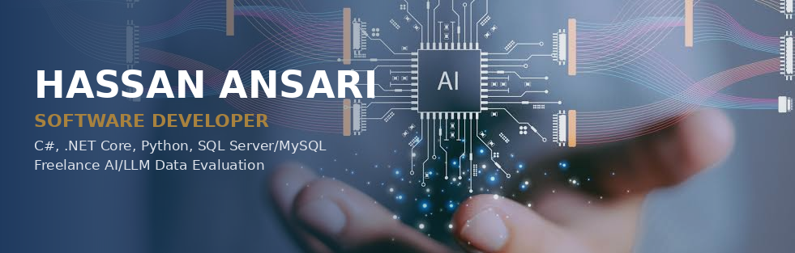

Software Developer working with C#, .NET Core, Python and SQL Server/MySQL, mostly building business software for automotive dealerships. I also take on freelance AI/LLM data evaluation work, and I trained originally as an architect, which still shapes how I approach a problem before writing any code.

## Where I work

Software Developer at Emsys Solutions Pvt Ltd (Malegaon), building desktop and web applications for vehicle showrooms - billing, inventory and sales - across the full development lifecycle, from database design through testing and deployment.

## Skills

**Languages**

       

**Web and frameworks**

      

**Databases and tools**

     

## Freelance: AI and data evaluation

RLHF and response ranking, preference data, red teaming, safety and policy review, hallucination detection, factuality checking, rubric application, SFT data authoring, prompt engineering, AI data QA, data annotation, and search relevance evaluation.

## Demo projects

Small, self-contained demos built for this portfolio. Each one runs entirely in the browser - no backend, no build step.

- [AutoBill](https://github.com/iam-hassan-ansari/autobill) - a billing and invoicing demo for a vehicle showroom.
- [Service Job Card Manager](https://github.com/iam-hassan-ansari/service-job-card-manager) - tracks vehicle service jobs from booking to delivery on a kanban-style board.
- [Smart Maintenance Portal](https://github.com/iam-hassan-ansari/smart-maintenance-portal) - a citizen complaint portal, a browser rebuild of a Java/MySQL project from my internship.
- [SQL Playground](https://github.com/iam-hassan-ansari/sql-playground) - a real SQLite database running in the browser via WebAssembly, with a sample showroom schema to query directly.
- [Four in a Row](https://github.com/iam-hassan-ansari/four-in-a-row) - a peer-to-peer online version of Connect Four using WebRTC, no server needed.
- [Memory Match](https://github.com/iam-hassan-ansari/memory-match) - a card-flip matching game with three difficulty levels and a saved best score per difficulty.
- [Maze Escape](https://github.com/iam-hassan-ansari/maze-escape) - a fresh maze generated on every play using a recursive backtracker algorithm.
- [Highway Rush](https://github.com/iam-hassan-ansari/highway-rush) - an endless traffic-dodging arcade game on HTML5 canvas.

## Background

Bachelor of Computer Application (BCA) - KTHM College, Nashik, and a Bachelor of Architecture - IES College of Architecture, Mumbai. I still work part-time as an architect alongside software development.

## Contact

 
